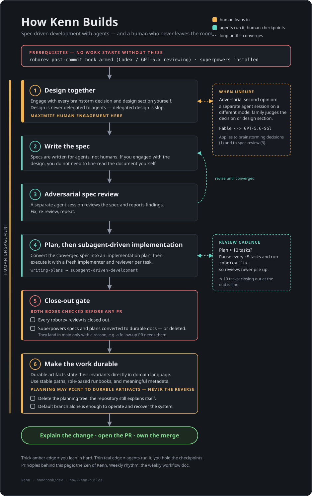

# Introduction

I have noticed that I have been asked a few times recently whether I am an "AI native" developer.

This is a somewhat loaded question, which I suspect is often really a variation of: "Are you continuing to do the upskilling that is necessary for you to not become obsolete as a developer?"

The easy answer to that question is: "Yes. I have been continually upskilling while I have worked as (different variations of) a software engineer. It's a privilege, and why I chose the job I do, to be always learning."

AI is no different; it has become clear in the last 18 months (Claude Code was launched in May 2025) that it is non-optional for developers who want to do their job as productively as possible to use AI coding agents in a variety of ways. I want to do my job as well as I possibly can; therefore, I upskill and use AI.

This is, in some respects, a primer for using AI in the terminal. This serves: as a resource for those who may wish to see which tools and skills are worth learning and using, as a record for myself, and (similar to other open source projects on a GitHub "portfolio") as evidence that I am an "AI native engineer" who knows how to do my job well.

However, AI is different from learning to use Kubernetes/the cloud.

This is therefore an essay of two halves. In §1, [On Being AI Native](#on-being-ai-native), I discuss the practical and ethical challenges of being an AI-native developer, and in §2, [Stack](#stack), I discuss practical tooling that I use to develop with AI.

[If you are only interested in reading about AI engineering tools, skip to here](#stack)

---

# On Being AI Native

## Slop

On 19th July 2025, Asahi Linux, the open source project which reverse engineers Apple Silicon chips to run Linux on Apple hardware, added [a commit](https://github.com/AsahiLinux/docs/commit/7c295dbb8af70a197f9ec705ca95dc35caa0a077) to their docs which read:

> It is the opinion of the Board that Large Language Models (LLMs), herein referred
> to as Slop Generators, are unsuitable for use as software engineering tools,
> ...
>
> The use of Slop Generators in _any_ contribution to the Asahi Linux project is
> expressly forbidden.

There is no doubt that AI tools can be, and very often are, used to generate slop, which we will define as "digital content made with generative artificial intelligence that is perceived as lacking in effort, **quality**, or meaning" ([from Wikipedia](https://en.wikipedia.org/wiki/AI_slop), emphasis my own [^1]).

In my professional life, I have worked as the senior engineer on repositories where I reviewed all code contributions. During this time, I have regularly had conversations on Pull Request reviews with team members along the lines of:

* Me: "Let's talk about your choice to use this, why did you make it?"
* PR Submitter: "I'm not sure, Tom."

* Me: "Good approach, but let's reconsider this choice."
* PR Submitter: "Great idea! We might want to reconsider this choice because of [a summary of what I said]. This is a great approach, but [suspiciously long justification for why the person disagrees. Lots of formatting, bullet points, sections, and emojis.]"

Some of these cases have been heinous instances of AI slop, and some of them may have been just less engaged/underpaid/overworked developers - I have noticed that they are often co-occurrent phenoema.

AI slop contributions are so common that I have found myself wishing that there were a workplace-appropriate version of `nohello.net`, a website that politely asks colleagues to send more than just "hello" in a message. Many of the anti-slop blog posts out there are angry, from developers who (perhaps rightly) are infuriated by AI slop wasting their time. But I will not send a colleague a blog post about AI slop/responsible AI use and reading outputs which calls AI slop a ["dereliction of duty as a software developer"](https://simonwillison.net/2025/Dec/18/code-proven-to-work/) or questions the use of AI altogether. The closest appropriate resource that I have found is `meatproxy.me`, but it's not professional enough and introduces a distracting analogy (meat proxy: where someone works as a "meat proxy" for AI).

In addition to pull requests, I have found that it's also common for AI slop to appear in prose writing (and PowerPoints, although I tend to pay less attention to these as a matter of professional interest). I can empathise with those who reach for AI for writing: I have noticed that many are people whose work ethic and competence I respect and admire, but they often feel limited because English is not their first language, or intimidated by writing after having spent years studying writing-lite subjects. However, I have never knowingly read, or generated myself, AI-generated prose and been happy with the output's clarity, concision, and content. Of course, there may be [skills](https://agentskills.io/specification) which can help here, and I expect that prose has been particularly diluted because, compared to coding (which, as established above, also has a slop problem), it has a lower barrier to entry: simply copy and paste from a browser-based chatbot. I often, but not always, notice a Dunning-Kruger effect here: people think they are being productive, or even helpful, by generating slop. There is also the possibility that I regularly read AI-generated content unknowingly which I enjoy and appreciate. For now, I prefer not to be an AI-native writer.

It feels that we have normalised, or accepted, AI slop. I can understand why people find this exhausting, and I rarely see AI slop being noted as unacceptable/inconsiderate. I expect that there will be a long cultural shift before AI slop becomes less acceptable or common.

### Slop as Contingent

AI slop is enough of a problem that it appears to have a clear definition and be a clear phenomenon which people can recognise. In fact, when talking about the economic benefits of AI, I suspect the productivity-hypers are overlooking the productivity disruption of (Gen)AI; many people are disengaged at their work and are happy to work a little less, with maybe worse quality, while using AI to complete cognitively non-trivial parts of their job for them.

However, we also know that Large Language Models are very capable. There is no denying that AI is very capable at coding, and will continue to improve (although this improvement is highly unlikely to be exponential). Last month, [the Asahi Linux maintainers updated their no-AI policy](https://github.com/AsahiLinux/docs/commit/715664a269937fe83293f46bbbeaae6094cb504e). The [new documentation reads](https://asahilinux.org/llm-policy/):

> Generative AI tools using large language models (LLMs) are widespread in software development today. While we acknowledge that these tools do have use cases, LLMs engender harms to the pillars of Asahi Linux

The document follows with a pragmatic and clear explanation of the particular risks of using LLMs, which have potentially been trained on leaked Apple documents and therefore could violate "the clean room requirements" for a reverse engineering open source project.

The label of LLM tools as "Slop Generators" is now missing, and LLM tools are even acknowledged as being widespread and "hav[ing] use cases". This reflects a wider sentiment in the community: LLMs are liminal tools, which _can_, but do not necessarily, substantially increase software development productivity for certain (perhaps many) use cases.

### Vibe Coding vs Agentic Engineering

Wes McKinney makes a distinction between vibe coding and agentic engineering.

Let's pause and define these terms. [Wikipedia's definition](https://en.wikipedia.org/wiki/Vibe_coding):

> Vibe coding is the software development practice assisted by artificial intelligence (AI) where the software developer describes a project or task in natural languages to a large language model (LLM), which generates source code automatically.
>
> Vibe coding may involve accepting AI-generated code without thorough review of the output, instead relying on results and follow-up prompts to guide changes.

Now let's go to McKinney's definition of agentic engineering. Before I define the term (as I expect this will become a source of continual confusion if both terms catch on), it's worth noting: definitions of "Agentic Engineering" appear to fall under the **first sentence** of vibe coding, but not the second. [Simon Willison](https://simonwillison.net/2026/Feb/23/agentic-engineering-patterns/) defines agentic engineering patterns as "coding practices and patterns to help get the best results out of this new era of coding agent development." When discussing agentic engineering, [Wes McKinney](https://wesmckinney.com/blog/agentic-engineering-aug-2026/#planning-architecture-and-caring-about-the-output) and Jesse Vincent emphasise that agentic engineering involves "caring about the output."

We can therefore provide a tentative definition of agentic engineering: "Output- and outcome-informed AI-assisted engineering, which prioritises informed human review to guide changes and design." I hope that this definition can tighten over time.

We can finally conclude on the slop challenge for AI. In my experience, AI slop is a huge challenge for responsible and productive use of AI. It is always tempting to [cognitively offload](https://www.psychologytoday.com/us/blog/psych-unseen/202605/your-brain-on-ai-cognitive-offloading-debt-and-atrophy) (offload tasks to AI, and lose one's ability at those tasks) and/or lapse into slop. Some developers may atrophy at previously core skills (for example, writing large numbers of lines of code by hand), but agentic engineering workflows are emerging, such as the below workflow, which maintain developers as essential operatives albeit with slightly different roles and responsibilities. Importantly, I believe that unsupervised "agentic loops" (which are beyond scope here) appear to degrade and produce worse output than asynchronously supervised agentic engineering workflows, such as the below example from Kenn Software:

This example is high-level, and the [Stack section](#stack) outlines more detail on an approach which is heavily inspired by this one.

## Ethics

Let's try to summarise the ethical problems for use of AI. I am sure there are more:

* **Intellectual Property**: LLMs were trained on a huge corpus of data which was acquired by effectively web-scraping the internet. Although there have been some small to moderate wins in legal systems, these are generally due to _how_ the data was acquired or stolen. For example, [Meta has gotten into hot water because Mark Zuckerberg allegedly explicitly approved use of LibGen, a website for pirating digital books](https://www.forbes.com/sites/danpontefract/2025/03/25/authors-challenge-metas-use-of-their-books-for-training-ai/). Fines for intellectual property violations are paltry in comparison to the tech firms' profits; for example, see [Google's fine](https://fortune.com/2024/03/20/google-250-million-euro-fine-france-news-publishers-ai-bard-gemini-training-data/). The ostensible legal principle appears to be that intellectual property (ownership by a person or persons of intangible creations of the human intellect) is at least heavily disrupted by LLMs. If we assume that intellectual property is a good thing (which is beyond scope to justify here), then there is an ethical quandary.
* **Energy**: There is a [climate crisis](https://www.unep.org/news-and-stories/story/climate-crisis-explained-seven-graphs). Whereas the current state of the climate is already very likely to lead to worse outcomes for almost all future humans, climate-impacting actions we take in the present and near future can significantly improve these outcomes. However, it takes a large amount of energy and other resources to build and sustain the microchips that perform inference (and all the other steps that physically sustain the software) and train new LLMs. Enormous AI data centres are being built and run to sustain LLMs. Due to cloud computing (substantial portions of the hardware being used to run software being outsourced to private providers in a manner which is completely abstracted from the hardware), very few people are ever visibly aware of the scale of current and future physical hardware use due to AI, and its knock-on climate impact. There is a surprisingly prevalent trend of people who believe that technology will eventually innovate enough to make climate impact redundant (for example, through colonising Mars or carbon capture), but I will assume that this is unrealistic.
* **Jobs**: I think I can count on two hands the number of people I have met who are making a start-up that will aim to "replace lawyers". I don't expect that these particular businesses will succeed, but that is mainly due to the hubris of the founders; I expect AI _could_ substantially change legal work. [Richard Susskind argues](https://global.oup.com/academic/product/the-future-of-the-professions-9780198841890) that eventually (although he does not say when) the professions will end due to disruption from technology. Professions here are industries that have been formally "professionalized", typically with education qualifications, such as law or accounting. I find that Susskind's and others' arguments too often conflate and interchange normative statements (what I want to be the case: _"In the society I want where we structure things efficiently, technology will end the professions."_) with positive statements (what is the case: _"Technology will end the professions."_) Nonetheless, it seems likely that AI can be highly disruptive to work. We have already seen above how AI has impacted my working life in a negative manner with AI slop. AI has already impacted employment in some industries substantially, such as translation. Lastly, AI is particularly disruptive for those who are not already experts or experienced.
* **Tech barons**: AI, among other booms in software, is creating mega-rich technology oligarchs. Oligarchs are regularly lobbying in their interests (and not in the interests of the many) in the political domain, while re-creating an economy that favours inequality. I will assume that this is a bad thing, and therefore that using services provided by these companies has some ethical implications.

On these above points, I feel little agency. One can make a distinction between personal ethics (the ethics that an individual can and should follow) and general ethics (the ethics that individuals, generally, should follow). I struggle to see a justification for this distinction generally, or for an exception in this case.

## Security

In 2025, Johann Rehberger coined "Normalization of Deviance in AI". This [can be summarised as](https://simonwillison.net/2025/Dec/31/the-year-in-llms/#the-year-of-yolo-and-the-normalization-of-deviance): "repeated exposure to risky behaviour without negative consequences leads people and organizations to accept that risky behaviour as normal."

When using a coding agent, particularly in "auto-mode" (or YOLO mode), an LLM can do nearly anything on your computer. In a corporate setting, we design secure private networks, with firewalls and proactive scanning for threats. At the same time, we regularly allow completely untrusted (and often unsupervised) AI to run with permissions to create processes on individuals' laptops.

In addition to security, we have normalised deviance in AI for privacy. Individuals' privacy considerations and expectations have already been gradually eroded by social media and passive observation companies such as Google (and, to a lesser extent, by governments through agencies such as the NSA/GCHQ). I am more concerned about this than most: I have opted out of using (almost all) social media for privacy reasons among other things. However, if I use a large language model then I am de facto giving up privacy to my employer or a large tech firm (in some situations, both). There is a deviance in my own behaviour here between my general approach to privacy and my use of LLMs. There are ways to improve the privacy posture. These include using an API wrapper for improved user privacy, and using a locally hosted model. The former is potentially more expensive and I am yet to see an established and transparent leader. The latter, self-hosting models, is prohibitively expensive.

## Hype

From 2020–23, it seemed that crypto and NFTs were the snake oil hype of the town. For digital art with NFTs, the economic hype could [seemingly be debunked with a right click](https://en.wikipedia.org/wiki/Non-fungible_token#Unenforceability_of_content_ownership). Generative AI is the new hype of the town, but it is in a different position from NFTs: the utility in some cases is now undeniable. With that said, there is a comparable phenomenon to NFTs where sales-focused actors seek to capitalise on hype rather than substance.

## Conclusion

Where do we go from here?

To be the best hands-on software engineer, using AI tooling is already beginning to become non-optional. At the same time: many, if not most, uses of AI constitute slop, using AI is arguably ethically questionable, security and privacy deviance is normalised with AI, and hype with over-promises surrounds the AI discourse. I expect that the ecosystem will mature over time for secure AI use, and in a less accessible but still present manner for privacy. The hype will decrease eventually, although we should all be concerned about the economic impacts given the enormous amount of circular borrowing to invest in AI data centres, financed in part by over-estimation of future revenues. Personal use of AI is ethically questionable, and in a way that seems to be more than just the ethical consequences of using a smartphone or other economic activity. In the following section, I discuss an answer to one of these points: eliminating (vibe-coded) slop with agentic engineering. I argue, through the example flows provided, that slop outputs from AI tools are contingent; in other words, it is possible to use AI to consistently generate high-quality outputs. Agentic engineering is a personal choice, however, and cultural challenges to decrease AI slop will continue

---

# Stack

A "tech stack" is ["the collection of tools, frameworks, programming languages, and platforms used to build and run an... application."](https://www.geeksforgeeks.org/blogs/what-are-tech-stacks-choosing-the-right-one/). In a corporate setting, one might ask, between or within teams, what their "tech stack" is; it's basically the collection of things which make up, and that are judged as worth mentioning, an application: which database the application uses, which coding language(s), which container runtime, which cloud, etc.

I will assume that there is no one best tech stack. For the language(s) that make up an application's tech stack, some people prefer C#, some people prefer Go, and no-one prefers Java (haha).

Similarly, one can have a tech stack for a developer environment. This will have some near-essential components (for example, Docker), but there are also reasonable preferences in a developer's environment. I make certain choices here, which are not necessarily correct or better. My preference is for: the operating system that I use to be Linux, and for most of my hands-on work to be in the terminal. My choices below are informed by these preferences.

## In-Terminal Agent

An in-terminal coding agent is a CLI to an AI chat completion endpoint that provides instructions, which the tool translates and runs if the operator approves, to ["autonomously read, write, and execute code in your repository."](https://github.com/bradAGI/awesome-cli-coding-agents#what-is-a-cli-coding-agent)

Each major closed-source model provider (Anthropic, OpenAI, Google[^2]) also offers a coding agent (respectively: Claude Code, Codex, and the Gemini CLI). Claude Code and Codex are both very good. I have not tried Gemini; the last time I monitored the internet it had been open sourced only recently and had poor reviews.

I regularly use Claude Code, simply because Anthropic models are reliably the best (however this changes all the time, of course) and Claude Code is the easiest (but not only) way to use them.

Codex and Gemini are both open source, whereas Claude Code is closed source. However, there are also coding agents which: 1. are open source, 2. are maintained by individuals who do not work for a big tech company and 3. make it relatively easy to switch model providers.

OpenCode is a very popular, relatively minimal, choice. When I used OpenCode about 6 months ago it was subjectively worse for me than the same models running on Claude Code/Codex. I expect that time, and the Claude Code source code leak, have directly and indirectly contributed to this evening out, and I would be interested to try OpenCode again.

I have been recommended other comparable tools, with far more features, such as [OhMyPi](https://github.com/can1357/oh-my-pi), but I have no need for the extra features I see when browsing the project's GitHub.

## Terminal Multiplexer

For developing in the terminal, even without use of AI, it is a natural choice to use a terminal multiplexer. A multiplexer can, in crude terms, be used to manage multiple tabs (sometimes called panes and windows) within a terminal, with both terms (windows and panes) being used in the sense that would be familiar to a browser (Chrome, Firefox) user.

It makes sense to be able to quickly split off from your in-terminal coding agent.

[Tmux](https://github.com/tmux/tmux) is the incumbent terminal multiplexer; it has been open source since 2007, and is a great piece of software. Tmux has a non-trivial barrier to entry, and although I committed to a similar level of initial pain to use neovim (an in-terminal code editor, best used keyboard-only, which is a little hard to use at first), I have never consistently adopted tmux into my development stack as a result.

The first terminal multiplexer that I adopted for everyday use was [Zellij](https://github.com/zellij-org/zellij). Zellij is a lovely tool, and I found the initial key-binding presets and hints helpful for quickly overcoming any learning curve.

More recently, I have adopted [herdr](https://github.com/herdrdev/herdr). In my opinion, herdr is equal to Zellij as a terminal multiplexer (or perhaps slightly worse, but this is only my opinion and marginal). I use herdr because of its features beyond simply managing terminal panes.

## Agent Watchers

[Charlie Marsh has described coding agents as](https://opensource.posit.co/resources/videos/2026-02-25_more-productive-but-a-lot-less-fun-with-charlie-marsh/): "a lot more productive, but a lot less fun."

I feel that there are some things that I recognise in this statement. I will assume that having fun/enjoyment/fulfilment in one's job (delivering code that delivers very good software) is a desirable outcome. When I first adopted terminal agents, I felt that I was more productive only for certain tasks, but less productive for many, and I lost enjoyment or even had a certain level of stress when developing.

AI agents will stop and require input from you as an operator to: summarise your discussion and implement anything (this is mild misalignment that needs correction), ask for permission to do something, or ask for clarification on requirements. LLMs (currently, and for the foreseeable future) take a long time to find further context or generate tokens. When I first used AI agents I therefore found it common to tab off to do another task in my terminal, and come back (forgetting the previous discussion briefly) to realise that the agent had been waiting for a long time for me to grant permission to perform a simple action. I found this stressful: it's like being a manager who is unable to keep track of things.

For this, there is a set of tools or features that we can describe as "agent watchers".

Some in-terminal agents offer some of the essential features for this natively (notifying you when the agent needs further input or not), but I prefer to use open source tools for this function.

I tried [Zellij-radar](https://github.com/marktoda/zj-radar), a Zellij plugin that provides a side pane to Zellij that is intended to poll multiple coding agents and notify you about their state. With the version I tried, it did not keep the state of the agents correctly and incorrectly told me that waiting/blocked agents were still working; hopefully this will improve as the project matures. [ghosthub](https://github.com/kenn-io/ghosthub) appears to be a very good open source tool, maintained by Wes McKinney, but it is only available on Apple Silicon hardware, which I do not have access to. It also appears to be a GUI over terminals, which I find less desirable than using purely TUIs in the terminal.

Needing an "agent watcher" motivated my switch to `herdr`. Herdr provides a side pane, which is very similar to Zellij-radar's intent. Herdr also provides notifications - these can be turned off, and I prefer to keep them on with a customised sound. This effectively removes any stress that arises over waiting for an agent to do something, and constantly context-switching just to unblock basic questions/permission requests. I believe that this has significantly improved both my productivity with, and enjoyment of, agentic engineering.

## Worktree Management

[Git worktrees](https://git-scm.com/docs/git-worktree) allow for isolated work trees, so that developers can check out more than one branch at once without cloning a repository more than once. Some of my colleagues used worktrees before AI, and I was a relative latecomer in this respect. Git worktrees are (in my opinion) essential when using AI agents locally because it is likely that you will check out more than one branch at once in the same repository. With plain `git checkout {branch}`, you would be blocked (in the same repository) from developing multiple branches at the same time.

For managing git worktrees, I use [worktrunk](https://github.com/max-sixty/worktrunk). Worktrunk creates a new workspace in a new directory that is at the same directory level as the repository. This is effectively syntactic sugar - it would be possible to achieve roughly the same thing (at least for the features I use) with some bash aliases. Good tools do simple things, with relatively few features, very well. I understand that there are native workspace features in `herdr`, although I am happy with `worktrunk` and have not felt the need to try these features.

## Diff Watcher

By definition, when using coding agents, you are less familiar with the low-level code changes. This is because the agent is writing the code, rather than you. (Although, when using coding agents, I still modify code myself, often with `fastmod` or `neovim`, because it's in fact much quicker.) For this, there is a category of tools which are effectively `git diff` watchers - they help you to follow the modifications the agent makes by watching what differs from the `main` branch. Claude Code has this functionality, to some extent, but its functionality is inferior and I prefer to have a diff watcher in a separate terminal pane that I can easily resize.

I have tried, and enjoy using, [hunk](https://github.com/modem-dev/hunk/). I mainly use the `hunk diff` command, which is very similar to `git diff` with nicer (default) rendering. I regularly run this in a pane next to a coding agent pane which is performing live edits. I have also been recommended [delta](https://github.com/dandavison/delta), which modifies `git diff`'s rendering.

## Specs

The workflow in the [Vibe Coding vs Agentic Engineering](#vibe-coding-vs-agentic-engineering) section includes generating architectural documents and specifications before implementation.

Initially I tried [openspec](https://github.com/Fission-AI/OpenSpec/) for this, although I found the default behaviour (with CLIs and multiple reasonably similar documents) not lightweight enough. I haven't tried [spec-kit](https://github.com/github/spec-kit), but I understand that it is reasonably similar to openspec but considered less lightweight.

I have landed on using the [superpowers](https://github.com/obra/superpowers) skills. I brainstorm, with the model, the specification file - the model writes it for me, and commits it on a new branch on a new workspace after I review. Reviewing the architectural/spec documents is essential - not reviewing these files necessarily degrades to slop/vibe-coding. I approve the implementation on a different branch from the worktree that the spec/architecture files are committed to; I do not merge spec files to main, and I expect long-term that it will not be a trend to do so for all spec files. I like that superpowers has a process, but it seems to guide the LLM to be quite pragmatic about how much spec detail to go into based on the size/scope of changes.

## Reviews

A new problem which has emerged from AI-assisted engineering is that there is too much code to review. Previously, lead engineers would meticulously read every single line of code as part of a PR review. In addition to others' code, you need to review your own new code (and lots of it); in fact, it's the agent's code until you review it.

LLMs can review code, in addition to writing it. [Superpowers](https://github.com/obra/superpowers#the-basic-workflow) has a code-review skill, which I like. The idea for the flow is: _before_ the human operator reviews the code, get an (adversarial) agent to review it. It is a common recommendation to use a different model provider for the review: so if you used Opus 5.5 to write the code, use GPT-6 to review the code. Theoretically, this seems like a sound recommendation: for humans [diversity is often recommended for high-performance teams](https://www.sciencedirect.com/science/article/abs/pii/S2352250X24000903), because different backgrounds can provide different perspectives that would have been overlooked. Different training data, or training data emphasis, between model providers can therefore surface issues upon review so that the human operator doesn't need to review all the written code. [roborev](https://github.com/kenn-io/roborev) deserves an honourable mention: it can be set up to run a review on every commit to a repository; I found the token use for this too high, so have disabled it, but otherwise I like the TUI and functionality.

## Skills and MCPs

Skills and MCPs were the big hype for AI a few months ago. I use MCPs with read-only access to a few tools, such as Jira and Datadog. I use various skills, which use my CLIs rather than a (lightweight) server via an MCP, which is often more convenient. However, when thinking about security and AI gateways in an enterprise setting with multiple users, I would feel much more comfortable exposing MCPs to users, because permissions are much easier to handle.

## Agent Sandbox

I have shipped AI agents to customers which run on GitHub Copilot to troubleshoot/ship infra for a new service/bump dependencies from a security scanning specification. This uses self-hosted runners where the agents are running in K8s and have access to various MCPs. I feel much more comfortable, security-wise, if my users are using these Copilot agents than if they are running things on their corporate laptops.

The next step for me involves using [K8s agent sandboxes](https://github.com/agent-sandbox/agent-sandbox) to create (relatively safer and more isolated) sandboxes to run untrusted code in an isolated environment, rather than on my own machine. For cost, it would be ideal if this were on a home lab, although I expect my initial experiments will start in EKS/AKS/GKE. `herdr` has what appear to be useful features for managing SSH sessions across multiple machines, which I expect could be useful for this use case.

## Conclusion

There are many great open source tools for agentic engineering with AI in the terminal, and I have covered many above. There may be some benefits and drawbacks of taking a terminal-based approach over commercial offerings (JetBrains) or free offerings with a strong plugin community (VScode), but I think that VSCode and terminal tooling are at the bleeding edge, because agentic engineering remains relatively new. My agentic engineering journey has been much like the rest of my software journey: by upskilling and proactivity, I have been able to develop a solid workflow and stack through trial and error

---

[^1]: I have dropped the continuation of the definition from Wikipedia: "and usually produced in high volume to gain advantage, to earn money, or to deceive people". One might add other things, such as usually coinciding with a lack of knowledge and expertise. However, I think it is best to use a minimal, neutral definition. Some of these components of the definition resonate, but I don't see them as a [necessary condition](https://plato.stanford.edu/entries/necessary-sufficient/) for content to be AI slop.
[^2]: People tend to be quite dismissive of Google models' current coding abilities, which may be justified, but their [market share as a model provider](https://axis-intelligence.com/llm-statistics/) safely puts them in the top three.
